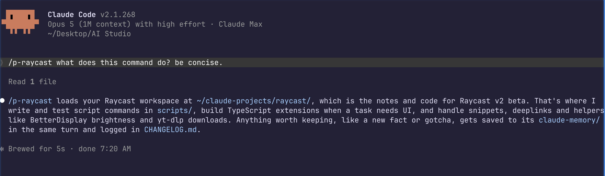

# claude-simple-projects

A project is a folder of context plus a skill that loads it. You explain your setup once, then call `/p-raycast` (or `/p-dotfiles`, or whatever you name it) and the agent already knows it.



*The `/p-raycast` project skill, running in my own setup.*

I kept re-explaining the same things to Claude. Where my Raycast scripts live, the metadata format, which ones I'd already built. Every session, from zero. So I gave it a project. Now I say "make me a Raycast script for X" and it knows where the scripts go, writes one, tests it, done. That one project saves me more typing than any prompt trick.

Claude Desktop has Projects: a folder of files the chat can see. This is that idea for Claude Code, and it's better. The context loads only when you call the skill, so it costs nothing the rest of the time. The agent writes back what it learns, so the project gets sharper on its own. And it runs in your terminal with full tools, not a chat box.

## How it works

A project is a folder at `~/claude-projects/<name>/` and a `/p-<name>` skill that loads it. Inside the folder:

| File | What it holds |
|---|---|
| `CLAUDE.md` | The brain. Rules for working here, a `## Memories` index, the facts needed nearly every session, and a map of where things live. Read first, every time. |
| `claude-memory/` | One durable fact per file: a path, a config value, a rule, a gotcha. Current state only. |
| `resources/` | Anything else worth keeping: scripts, docs, exports, PDFs. Free-form. |
| `CHANGELOG.md` | One dated line per change, newest first. The history that memory doesn't keep. |

The skill itself only says "read `CLAUDE.md` and follow it". All the rules live in the folder, so the skill and the project never drift apart.

You call `/p-raycast`. The agent reads `CLAUDE.md`, scans the index, and opens only the memory files the task needs. You work. The rules under `How to work here` do the rest:

- **Write the moment a fact lands.** A new fact gets its memory file in the same turn, not at the end of the session when the agent has already forgotten it.
- **Your word wins.** Contradict a file and the file gets rewritten that turn.
- **Memory holds now, the changelog holds what moved.** So "what did we change five weeks ago" has a dated line to find.
- **The files are a cache, not the truth.** On a miss, the agent searches your past Claude Code chats with `/past-conversations` before it says it doesn't know.
- **Leave every file you touch true.** A stale line gets fixed the turn the agent spots it. That's the whole cleanup process.

## Quickstart

```bash
git clone https://github.com/Pawel-Kica/claude-simple-projects
cd claude-simple-projects
claude "Read SETUP.md and follow it"
```

Claude installs `/project-create` and `/past-conversations`, then offers to build your first project. It asks the name, what the project is for, the facts you already know, and the rules it must never break. A few questions later you have a folder and a `/p-<name>` skill to call it.

Got a notes folder already? Move it to `~/claude-projects/<name>/` and run `/project-create`. It folds your notes in and never overwrites them.

## What a project looks like

`examples/raycast/` is my real Raycast project with the private parts taken out. Eleven one-fact memory files, a changelog, doc links in `resources/`, and four working script commands. One quirk worth copying: `scripts/` sits at the top level instead of `resources/`, because Raycast has that exact path registered and moving it would unregister every script.

## Pairs with claude-simple-memory

A project uses the same one-fact-per-file memory as [claude-simple-memory](https://github.com/Pawel-Kica/claude-simple-memory), scoped to one folder, plus `resources/` and a changelog. Install claude-simple-memory too if you also want global and per-repo memory. You don't need it first, this stands on its own.

## What's in the repo

| Path | What |
|---|---|
| `SETUP.md` | The setup prompt. Claude reads it and installs everything |
| `skills/project-create/` | Creates a project folder and its `/p-<name>` skill |
| `skills/past-conversations/` | Searches and resumes past Claude Code chats, the fallback when memory has nothing |
| `examples/raycast/` | A real project to copy the shape from |

## License

MIT
